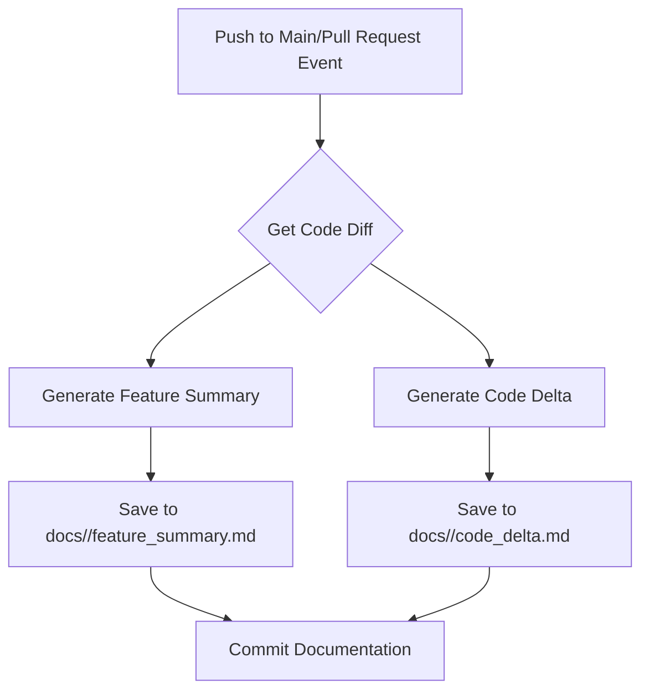

# AI Documentation System Feature Document

## Summary of Changes

This update significantly enhances the AI-powered documentation system.  The previous system only generated a single Markdown file summarizing code changes. This version now generates two distinct documentation files for each commit: a high-level feature summary and a detailed code delta analysis. The system also handles pull requests, triggering documentation generation upon opening and synchronization.  Finally, the documentation is now organized into subdirectories based on the commit hash, improving organization and traceability.

## New Features / Fixes

* **Enhanced Documentation Generation:** The system now produces two types of documentation:
    * **Feature Summary:** A high-level overview of changes, including a bulleted list of new features/fixes, usage examples, and a Mermaid flowchart for complex logic.
    * **Code Delta Analysis:** A detailed, file-by-file breakdown of code changes, including technical reasoning for each modification.
* **Pull Request Support:** Documentation is now automatically generated for pull requests upon opening and each subsequent update.
* **Improved Documentation Organization:** Documentation files are stored in subdirectories named after the commit SHA, improving organization and version control.
* **Robust Error Handling:** Improved error handling for Gemini API calls and missing environment variables.
* **Renamed Workflow:** The GitHub Actions workflow is renamed from `AI Documentation Agent` to `AI Documentation System`.


## How to Use

The system automatically generates documentation upon pushes to the `main` branch and pull request events. No user interaction is required beyond ensuring the `GEMINI_API_KEY` secret is correctly set in the GitHub repository settings.  The generated documentation will be found under the `docs` directory, organized by commit SHA.

**Example Generated File Structure:**
```
docs/
├── a1b2c3d4/
│   ├── feature_summary.md
│   └── code_delta.md
└── e5f6g7h8/
    ├── feature_summary.md
    └── code_delta.md 
```

## Visual Flowchart (Simplified)

The workflow now involves two parallel processes for generating documentation types:



This flowchart simplifies the actual process, omitting details like API calls and error handling for clarity.  The crucial aspect is the parallel generation of two distinct documentation types.
